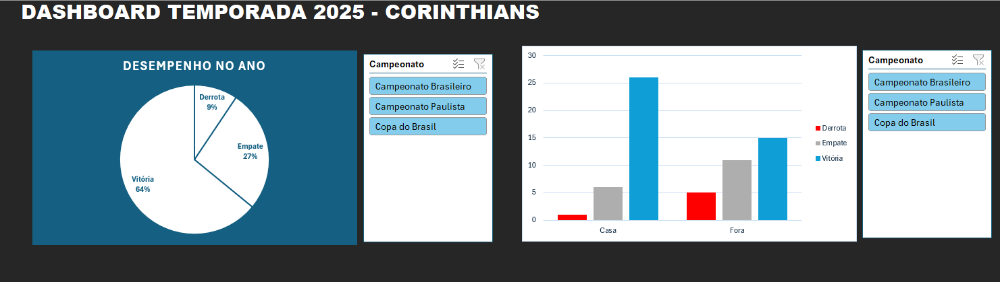

# 🦅 Análise de Dados - Temporada Corinthians 2025

## 📊 Sobre o Projeto
Projeto pessoal *end-to-end* de Análise de Dados focado na temporada de 2025 do Corinthians. O objetivo foi extrair, estruturar e analisar os dados de todos os jogos do Campeonato Paulista, Copa do Brasil e Brasileirão para gerar insights sobre o desempenho da equipe.

## 🛠️ Ferramentas Utilizadas
* **Banco de Dados Relacional:** SQLite (DB Browser) para criação estruturada, inserção e consulta de dados (SQL).
* **Tratamento e Extração (ETL):** Consultas SQL com `JOIN` para exportação em formato CSV.
* **Análise e Visualização:** Microsoft Excel (Tabelas Dinâmicas, Funções Lógicas e Dashboards Interativos).

## 🗂️ Estrutura dos Dados
O banco de dados foi modelado em duas tabelas principais para garantir as boas práticas de normalização:
1. `campeonatos`: ID e Nome do Campeonato.
2. `jogos`: Data, Adversário, Mando de Campo, Gols Marcados, Gols Sofridos e ID do Campeonato (Chave Estrangeira).

## 📈 Principais Insights (Dashboard)
Dashboard criado no Excel, para analisar:
* O percentual de Vitórias, Empates e Derrotas no ano (Aproveitamento total).
* O desempenho da equipe jogando como Mandante (Neo Química Arena) vs. Visitante.
* *Filtros dinâmicos* permitindo a segmentação do desempenho por campeonato específico.

## 🚀 Como visualizar
* O arquivo `.db` contém o banco de dados completo estruturado.
* O arquivo `.csv` contém a base plana tratada e pronta para consumo.
* O arquivo `.xlsx` contém as tabelas dinâmicas e o Dashboard final com as análises visuais.

## 🖥️ Visualização do Dashboard

